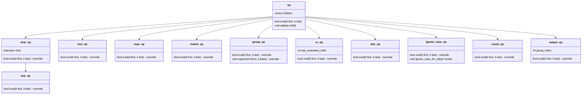

# Theory of Programming Languages course - DT096G

 **Table of content:**
 - [Lab 1](#item-one)
 - [Lab 2](#item-two)
 - [Lab 3](#item-three)

<a id="item-one"></a>
## [Lab 1](/L1_PARSING): Parsing

Grammar for the parser:
```
  <MATCH>           ->  <EXPR>
  <EXPR>            ->  <OR>  |  <STAR>  |  <GROUP>  |  <ANY>  |  <COUNT>  |  <IGNORE_CASE>  |  <OUTPUT>  |  <TEXT>
  <OR>              ->  <TEXT>  +  <TEXT>
  <STAR>            ->  <TEXT>  *
  <GROUP>           ->  (  <EXPR>  )
  <ANY>             ->  .
  <COUNT>           ->  <CHAR>  {  <NUMBER>  } |  <ANY>  {  <NUMBER>  }
  <IGNORE_CASE>     ->  <TEXT>  \I
  <OUTPUT>          ->  <EXPR>  \O{  <NUMBER>  }
  <TEXT>            ->  <CHAR> [<TEXT>]
  <NUMBER>          ->  <DIGIT>  [<NUMBER>]
  <CHAR>            ->  any non-special character                  
```

> [!NOTE]
> `<OUTPUT>` is not fully implemented.

<details>
  <summary>Class diagram (Click to expand)</summary>


</details>

<a id="item-two"></a>
## [Lab 2](/L2_JS): Investigation of the Javascript prototype programming paradigm

This task involves creating an Iterator for JavaScript arrays using two approaches:

1. **Class-based (`main.js`)**: A class `ArrayIterator` is defined with `hasNext()` and `next()` methods.

```javascript
class ArrayIterator { /*...*/ }
```

2. **Prototype-based (`main2.js`)**: An `iterator` method is added to the Array prototype, returning an object with `hasNext()` and `next()` methods.

```javascript
Array.prototype.iterator = function() { /*...*/ }
```

Usage:

```javascript
const array = [1, 2, 3, 4, 5, 6, 7, 8, 9, 10];
const iterator = array.iterator(); // Or new ArrayIterator(array)

while (iterator.hasNext()) {
    console.log(iterator.next());
}
```

<a id="item-three"></a>
## [Lab 3](/L3_CPP): Investigation of the C++ templating mechanism and implementation of an algorithm solved at compile time
### Task
Implement a template class/struct for a compile-time power function. The exponent is an integer template argument, and the base is a function argument.

```cpp
template<int Exponent>
struct power<Exponent, std::enable_if_t<(Exponent >= 0)>> {
    template<typename BaseType>
    static constexpr BaseType calculatePower(BaseType base) {
        return Exponent == 0 ? 1 : base * power<Exponent - 1>::calculatePower(base);
    }
};
```

<br>

[](https://github.com/bl4ckswordsman/DT096G/)
[](https://hits.seeyoufarm.com/api/count/graph/dailyhits.svg?url=https://github.com/bl4ckswordsman/DT096G) <!-- 2024-02-14 -->

