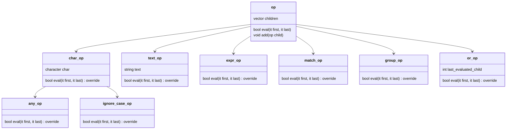

# Theory of Programming Languages course - DT096G

 **Table of content:**
 - [Lab 1](#item-one)
 - [Lab 2](#item-two)
 - [Lab 3](#item-three)

## [Lab 1](/L1_PARSING): Parsing

## [Lab 2](/L2_JS): Investigation of the Javascript prototype programming paradigm

## [Lab 3](/L3_CPP): Investigation of the C++ templating mechanism and implementation of an algorithm solved at compile time

## [Lab 4](/L4): ---

 

 <!-- 2024-02-14 -->

